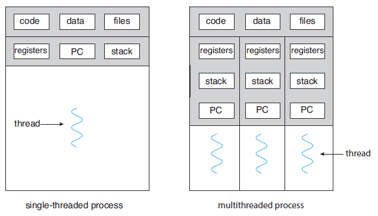
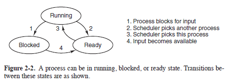
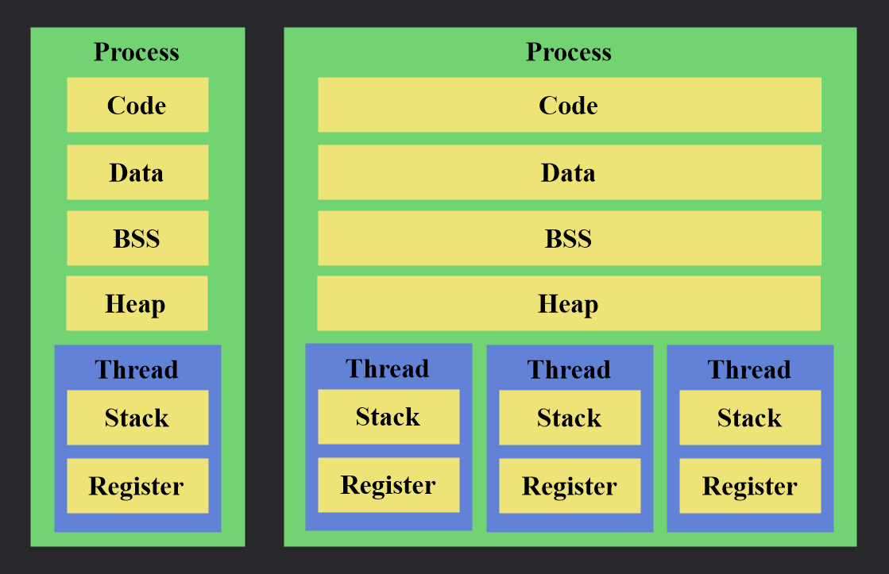
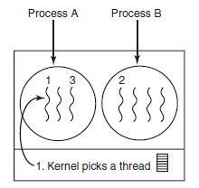
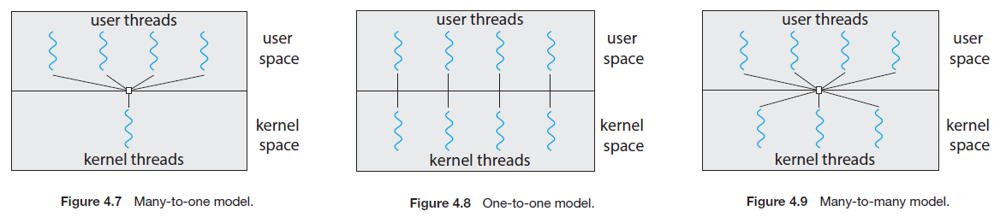

# How [threads](https://en.wikipedia.org/wiki/Thread_(computing)) works

- **I will try to minimize the number of topics, or avoid mentioning related topics if I can explain without them, because more topics make more difficult to understand.**

- **I will try to summarize each topic in my word as simple as possible. However, please correct me if it is wrong.**

- **Understanding of [operating system](https://en.wikipedia.org/wiki/Operating_system) is inevitable. So I will begin with a brief explanation of [operating system](https://en.wikipedia.org/wiki/Operating_system).**

## What is [operating system](https://en.wikipedia.org/wiki/Operating_system)?

|

|

|
|---|---|

- **An [operating system](https://en.wikipedia.org/wiki/Operating_system) is a [software](https://en.wikipedia.org/wiki/Software) that manages [computer](https://en.wikipedia.org/wiki/Computer) [resources](https://en.wikipedia.org/wiki/Resource#Computer_resources), such as [hardware](https://en.wikipedia.org/wiki/Computer_hardware) and [software](https://en.wikipedia.org/wiki/Software).**

References

>An [operating system (OS)](https://en.wikipedia.org/wiki/Operating_system) is system [software](https://en.wikipedia.org/wiki/Software) that manages computer [hardware](https://en.wikipedia.org/wiki/Computer_hardware), [software](https://en.wikipedia.org/wiki/Software) [resources](https://en.wikipedia.org/wiki/Resource#Computer_resources), and provides common services for computer programs.
>
https://en.wikipedia.org/wiki/Operating_system

>An [operating system](https://en.wikipedia.org/wiki/Operating_system) is [software](https://en.wikipedia.org/wiki/Software) that manages a [computer](https://en.wikipedia.org/wiki/Computer)’s [hardware](https://en.wikipedia.org/wiki/Computer_hardware).
>
3p, Operating System Concepts 10th edition, Abraham Silberschatz

>A more common definition, and the one that we usually follow, is that the [operating system](https://en.wikipedia.org/wiki/Operating_system) is the one program running at all times on the [computer](https://en.wikipedia.org/wiki/Computer)—usually called the [kernel](https://en.wikipedia.org/wiki/Kernel_(operating_system)).
>
6p, Operating System Concepts 10th edition, Abraham Silberschatz

>An [operating system](https://en.wikipedia.org/wiki/Operating_system) is a [resource](https://en.wikipedia.org/wiki/Resource#Computer_resources) manager. The system’s [CPU](https://en.wikipedia.org/wiki/Central_processing_unit), memory space, file-storage space, and I/O devices are among the [resources](https://en.wikipedia.org/wiki/Resource#Computer_resources) that the [operating system](https://en.wikipedia.org/wiki/Operating_system) must manage.
>
27p, Operating System Concepts 10th edition, Abraham Silberschatz

>It is hard to pin down what an [operating system](https://en.wikipedia.org/wiki/Operating_system) is other than saying it is the [software](https://en.wikipedia.org/wiki/Software) that runs in [kernel](https://en.wikipedia.org/wiki/Kernel_(operating_system)) mode—and even that is not always true. Part of the problem is that [operating systems](https://en.wikipedia.org/wiki/Operating_system) perform two essentially unrelated functions: providing application programmers (and application programs, naturally) a clean abstract set of [resources](https://en.wikipedia.org/wiki/Resource#Computer_resources) instead of the messy [hardware](https://en.wikipedia.org/wiki/Computer_hardware) ones and managing these [hardware](https://en.wikipedia.org/wiki/Computer_hardware) [resources](https://en.wikipedia.org/wiki/Resource#Computer_resources).
>
3p, Modern Operating Systems 4th edition, Andrew S. Tanenbaum

## What is [kernel](https://en.wikipedia.org/wiki/Kernel_(operating_system))?

  

- The [kernel](https://en.wikipedia.org/wiki/Kernel_(operating_system)) is a computer program at the core of a [computer](https://en.wikipedia.org/wiki/Computer)'s [operating system](https://en.wikipedia.org/wiki/Operating_system) and generally has complete control over everything in the system.

References

>The [kernel](https://en.wikipedia.org/wiki/Kernel_(operating_system)) is a computer program at the core of a [computer](https://en.wikipedia.org/wiki/Computer)'s [operating system](https://en.wikipedia.org/wiki/Operating_system) and generally has complete control over everything in the system.
>
https://en.wikipedia.org/wiki/Kernel_(operating_system)

## What are the types of [operating system](https://en.wikipedia.org/wiki/Operating_system)?

- **Single-tasking and [multi-tasking](https://en.wikipedia.org/wiki/Computer_multitasking) (Time-Sharing)**
- **Single-user and multi-user**
- **Distributed**
- **Templated**
- **Embedded**
- **Real-time**
- **Library**
- **Batch**
- **Network**
- **Multiprocessing**
- **Mobile**

**Only [multi-tasking](https://en.wikipedia.org/wiki/Computer_multitasking) [operating system](https://en.wikipedia.org/wiki/Operating_system) will be handled in this article.**

References

>- Single-tasking and [multi-tasking](https://en.wikipedia.org/wiki/Computer_multitasking)
>- Single-user and multi-user
>- Distributed
>- Templated
>- Embedded
>- Real-time
>- Library
>
https://en.wikipedia.org/wiki/Operating_system#Types_of_operating_systems

>- Batch
>- [Multi-tasking](https://en.wikipedia.org/wiki/Computer_multitasking)
>- Distributed
>- Network
>- Real-Time
>
https://www.geeksforgeeks.org/types-of-operating-systems/

>- Batch
>- [Multi-tasking](https://en.wikipedia.org/wiki/Computer_multitasking) / Time Sharing
>- Multiprocessing
>- Real time
>- Distributed
>- Network
>- Mobile
>
https://www.guru99.com/operating-system-tutorial.html#types-of-operating-system

## What are the functions of [operating system](https://en.wikipedia.org/wiki/Operating_system)?

- **[Process management](https://en.wikipedia.org/wiki/Process_management_(computing))**
- **Memory management**
- **File system management**
- **Mass storage management**
- **Cache management**
- **I/O system management**
- **Security and protection**

**Only [process management](https://en.wikipedia.org/wiki/Process_management_(computing)) will be handled in this article.**

References

>- Security
>- Control over system performance
>- Job accounting
>- Error detecting aids
>- Coordination between other software and users
>- Memory Management
>- [Processor Management](https://en.wikipedia.org/wiki/Process_management_(computing))
>- Device Management
>- File Management
>
https://www.geeksforgeeks.org/functions-of-operating-system/

>- [Process management](https://en.wikipedia.org/wiki/Process_management_(computing))
>- Memory management
>- File management
>- Device Management
>- I/O System Management
>- Secondary-Storage Management
>- Security
>- Command interpretation
>- Networking
>- Job accounting
>- Communication management
>
https://www.guru99.com/operating-system-tutorial.html#functions-of-operating-system/

>- [Process Management](https://en.wikipedia.org/wiki/Process_management_(computing))
>- Memory Management
>- File-System Management
>- Mass-Storage Management
>- Cache Management
>- I/O System Management
>- Security and Protection
>
27p, Operating System Concepts 10th edition, Abraham Silberschatz

## Why does the definition, types, and functions of [operating system](https://en.wikipedia.org/wiki/Operating_system) vary?

>In general, we have **no completely adequate definition of an [operating system](https://en.wikipedia.org/wiki/Operating_system)**.
>
5p, Operating System Concepts 10th edition, Abraham Silberschatz

>In addition, we have **no universally accepted definition of what is part of the [operating system](https://en.wikipedia.org/wiki/Operating_system)**.
>
6p, Operating System Concepts 10th edition, Abraham Silberschatz

>It is **hard to pin down what an [operating system](https://en.wikipedia.org/wiki/Operating_system) is** other than saying it is the **software that runs in kernel mode**—and even that is not always true.
>
3p, Modern Operating Systems 4th edition, Andrew S. Tanenbaum

## What is [multi-tasking](https://en.wikipedia.org/wiki/Computer_multitasking)?

  

- **[Multi-tasking](https://en.wikipedia.org/wiki/Computer_multitasking) is the [concurrent](https://en.wikipedia.org/wiki/Concurrency_(computer_science)) execution of multiple [tasks](https://en.wikipedia.org/wiki/Task_(computing)) on [CPU](https://en.wikipedia.org/wiki/Central_processing_unit) or [CPU](https://en.wikipedia.org/wiki/Central_processing_unit) cores.**

**For more detail about [concurrency](https://en.wikipedia.org/wiki/Concurrency_(computer_science)), read [Parallel Computing](https://github.com/ysoh880710/ParallelComputing).**

References

>[Multi-tasking](https://en.wikipedia.org/wiki/Computer_multitasking) is the [concurrent](https://en.wikipedia.org/wiki/Concurrency_(computer_science)) execution of multiple [tasks](https://en.wikipedia.org/wiki/Task_(computing)) (also known as [processes](https://en.wikipedia.org/wiki/Process_(computing))) over a certain period of time.
>
https://en.wikipedia.org/wiki/Computer_multitasking

>In [multitasking](https://en.wikipedia.org/wiki/Computer_multitasking) systems, the [CPU](https://en.wikipedia.org/wiki/Central_processing_unit) executes multiple [processes](https://en.wikipedia.org/wiki/Process_(computing)) by switching among them, but the switches occur frequently, providing the user with a fast response time.
>
23p, Operating System Concepts 10th edition, Abraham Silberschatz

>A [multitasking](https://en.wikipedia.org/wiki/Computer_multitasking) [operating system](https://en.wikipedia.org/wiki/Operating_system) divides the available processor time among the [processes](https://en.wikipedia.org/wiki/Process_(computing)) or [threads](https://en.wikipedia.org/wiki/Thread_(computing)) that need it.
>
https://docs.microsoft.com/en-us/windows/win32/procthread/multitasking

## What is [process management](https://en.wikipedia.org/wiki/Process_management_(computing))?

- **[Process management](https://en.wikipedia.org/wiki/Process_management_(computing)) is managing [process](https://en.wikipedia.org/wiki/Process_(computing)) creation, deletion, [scheduling](https://en.wikipedia.org/wiki/Scheduling_(computing)#Process_scheduler), suspension, resume, synchronization, and communication.**

**Only [process scheduling](https://en.wikipedia.org/wiki/Scheduling_(computing)#Process_scheduler) will be handled in this article.**

References

>An integral part of any modern-day [operating system (OS)](https://en.wikipedia.org/wiki/Operating_system). The [OS](https://en.wikipedia.org/wiki/Operating_system) must allocate [resources](https://en.wikipedia.org/wiki/Resource#Computer_resources) to [processes](https://en.wikipedia.org/wiki/Process_(computing)), enable [processes](https://en.wikipedia.org/wiki/Process_(computing)) to share and exchange information, protect the [resources](https://en.wikipedia.org/wiki/Resource#Computer_resources) of each [process](https://en.wikipedia.org/wiki/Process_(computing)) from other [processes](https://en.wikipedia.org/wiki/Process_(computing)) and enable synchronization among [processes](https://en.wikipedia.org/wiki/Process_(computing)).
>
https://en.wikipedia.org/wiki/Process_management_(computing)

>[Process management](https://en.wikipedia.org/wiki/Process_management_(computing)) involves various [tasks](https://en.wikipedia.org/wiki/Task_(computing)) like creation, [scheduling](https://en.wikipedia.org/wiki/Scheduling_(computing)), termination of [processes](https://en.wikipedia.org/wiki/Process_(computing)), and a dead lock.
>
https://www.guru99.com/process-management-pcb.html

>The [operating system](https://en.wikipedia.org/wiki/Operating_system) is responsible for the following activities in connection with [process management](https://en.wikipedia.org/wiki/Process_management_(computing)):
>- Creating and deleting both user and system [processes](https://en.wikipedia.org/wiki/Process_(computing))
>- [Scheduling](https://en.wikipedia.org/wiki/Scheduling_(computing)) [processes](https://en.wikipedia.org/wiki/Process_(computing)) and [threads](https://en.wikipedia.org/wiki/Thread_(computing)) on the [CPUs](https://en.wikipedia.org/wiki/Central_processing_unit)
>- Suspending and resuming [processes](https://en.wikipedia.org/wiki/Process_(computing))
>- Providing mechanisms for [process](https://en.wikipedia.org/wiki/Process_(computing)) synchronization
>- Providing mechanisms for [process](https://en.wikipedia.org/wiki/Process_(computing)) communication
>
28p, Operating System Concepts 10th edition, Abraham Silberschatz

## What is [process scheduling](https://en.wikipedia.org/wiki/Scheduling_(computing)#Process_scheduler)?

  

- **[Process scheduling](https://en.wikipedia.org/wiki/Scheduling_(computing)#Process_scheduler) is selecting an available [process](https://en.wikipedia.org/wiki/Process_(computing)) which will be executed on a [CPU](https://en.wikipedia.org/wiki/Central_processing_unit) or [CPU](https://en.wikipedia.org/wiki/Central_processing_unit) core.**

- **There are [preemptive](https://en.wikipedia.org/wiki/Preemption_(computing)#Preemptive_multitasking) and [nonpreemptive](https://en.wikipedia.org/wiki/Cooperative_multitasking), or also called [cooperative](https://en.wikipedia.org/wiki/Cooperative_multitasking), [process scheduling](https://en.wikipedia.org/wiki/Scheduling_(computing)#Process_scheduler) schemes.**

References

>The [process scheduler](https://en.wikipedia.org/wiki/Scheduling_(computing)#Process_scheduler) is a part of the [operating system](https://en.wikipedia.org/wiki/Operating_system) that decides which [process](https://en.wikipedia.org/wiki/Process_(computing)) runs at a certain point in time.
>
https://en.wikipedia.org/wiki/Scheduling_(computing)#Process_scheduler

>The [process scheduler](https://en.wikipedia.org/wiki/Scheduling_(computing)#Process_scheduler) selects an available [process](https://en.wikipedia.org/wiki/Process_(computing)) (possibly from a set of several available [processes](https://en.wikipedia.org/wiki/Process_(computing))) for program execution on a core.
>
110p, Operating System Concepts 10th edition, Abraham Silberschatz

>The role of the [process scheduler](https://en.wikipedia.org/wiki/Scheduling_(computing)#Process_scheduler) is to select an available [process](https://en.wikipedia.org/wiki/Process_(computing)) to run on a [CPU](https://en.wikipedia.org/wiki/Central_processing_unit).
>
153p, Operating System Concepts 10th edition, Abraham Silberschatz

>If only one [CPU](https://en.wikipedia.org/wiki/Central_processing_unit) is available, a choice has to be made which [process](https://en.wikipedia.org/wiki/Process_(computing)) to run next. The part of the operating system that makes the choice is called the scheduler, and the algorithm it uses is called the [scheduling](https://en.wikipedia.org/wiki/Scheduling_(computing)) algorithm.
>
149p, Modern Operating Systems 4th edition, Andrew S. Tanenbaum

### [Preemptive multitasking](https://en.wikipedia.org/wiki/Preemption_(computing)#Preemptive_multitasking)

>The term [preemptive multitasking](https://en.wikipedia.org/wiki/Preemption_(computing)#Preemptive_multitasking) is used to distinguish a multitasking operating system, which permits preemption of tasks, from a cooperative multitasking system wherein processes or tasks must be explicitly programmed to yield when they do not need system resources.

## What are [preemptive](https://en.wikipedia.org/wiki/Preemption_(computing)#Preemptive_multitasking) and [nonpreemptive](https://en.wikipedia.org/wiki/Cooperative_multitasking) [process scheduling](https://en.wikipedia.org/wiki/Scheduling_(computing)#Process_scheduler)?

  

- [Preemptive](https://en.wikipedia.org/wiki/Preemption_(computing)#Preemptive_multitasking) [process scheduling](https://en.wikipedia.org/wiki/Scheduling_(computing)#Process_scheduler) allows suspension of currently executing [process](https://en.wikipedia.org/wiki/Process_(computing)).
- [Nonpreemptive](https://en.wikipedia.org/wiki/Cooperative_multitasking) [process scheduling](https://en.wikipedia.org/wiki/Scheduling_(computing)#Process_scheduler) does not allow suspension of currently executing [process](https://en.wikipedia.org/wiki/Process_(computing)).

References

>Preemptive multitasking involves the use of an interrupt mechanism which suspends the currently executing [process](https://en.wikipedia.org/wiki/Process_(computing)) and invokes a scheduler to determine which [process](https://en.wikipedia.org/wiki/Process_(computing)) should execute next.
>
https://en.wikipedia.org/wiki/Preemption_(computing)#Preemptive_multitasking

>Cooperative multitasking, also known as non-preemptive multitasking, is a style of computer multitasking in which the operating system never initiates a [context switch](https://en.wikipedia.org/wiki/Context_switch) from a running [process](https://en.wikipedia.org/wiki/Process_(computing)) to another [process](https://en.wikipedia.org/wiki/Process_(computing)).
>
https://en.wikipedia.org/wiki/Cooperative_multitasking

>Under [nonpreemptive scheduling](https://en.wikipedia.org/wiki/Cooperative_multitasking), once the [CPU](https://en.wikipedia.org/wiki/Central_processing_unit) has been allocated to a [process](https://en.wikipedia.org/wiki/Process_(computing)), the [process](https://en.wikipedia.org/wiki/Process_(computing)) keeps the [CPU](https://en.wikipedia.org/wiki/Central_processing_unit) until it releases it either by terminating or by switching to the waiting state.
>
202p, Operating System Concepts 10th edition, Abraham Silberschatz

>A [nonpreemptive scheduling](https://en.wikipedia.org/wiki/Cooperative_multitasking) algorithm picks a [process](https://en.wikipedia.org/wiki/Process_(computing)) to run and then just lets it run until it blocks (either on I/O or waiting for another [process](https://en.wikipedia.org/wiki/Process_(computing))) or voluntarily releases the [CPU](https://en.wikipedia.org/wiki/Central_processing_unit).
>
153p, Modern Operating Systems 4th edition, Andrew S. Tanenbaum

>In contrast, a [preemptive scheduling](https://en.wikipedia.org/wiki/Preemption_(computing)#Preemptive_multitasking) algorithm picks a [process](https://en.wikipedia.org/wiki/Process_(computing)) and lets it run for a maximum of some fixed time.
>
153p, Modern Operating Systems 4th edition, Andrew S. Tanenbaum

## What are the types of [process scheduling](https://en.wikipedia.org/wiki/Scheduling_(computing)#Process_scheduler)?

  

- **Selecting an available [process](https://en.wikipedia.org/wiki/Process_(computing)) and putting it into a [ready queue](https://en.wikipedia.org/wiki/Process_state#Ready). This is also called [long-term scheduling](https://en.wikipedia.org/wiki/Scheduling_(computing)#Long-term_scheduling) or admission [scheduling](https://en.wikipedia.org/wiki/Scheduling_(computing)).**
- **Selecting a [process](https://en.wikipedia.org/wiki/Process_(computing)) in a ready queue and allocate a [CPU](https://en.wikipedia.org/wiki/Central_processing_unit) or [CPU](https://en.wikipedia.org/wiki/Central_processing_unit) core. This is also called [short-term scheduling](https://en.wikipedia.org/wiki/Scheduling_(computing)#Short-term_scheduling) or [CPU](https://en.wikipedia.org/wiki/Central_processing_unit) [scheduling](https://en.wikipedia.org/wiki/Scheduling_(computing)). Also, this [scheduling](https://en.wikipedia.org/wiki/Scheduling_(computing)) involves [context switch](https://en.wikipedia.org/wiki/Context_switch).**
- **Removing a [process](https://en.wikipedia.org/wiki/Process_(computing)) from memory to disk, which is called swap out, in order to reduce the degree of multiprogramming, and restoring the [process](https://en.wikipedia.org/wiki/Process_(computing)) from disk to memory, which is called swap in. This is also called [medium-term scheduling](https://en.wikipedia.org/wiki/Scheduling_(computing)#Medium-term_scheduling) or swapping.**

References

>The [long-term scheduler](https://en.wikipedia.org/wiki/Scheduling_(computing)#Long-term_scheduling), or admission scheduler, decides which jobs or [processes](https://en.wikipedia.org/wiki/Process_(computing)) are to be admitted to the [ready queue](https://en.wikipedia.org/wiki/Process_state#Ready) (in main memory).
>
https://en.wikipedia.org/wiki/Scheduling_(computing)#Long-term_scheduling

>The [medium-term scheduler](https://en.wikipedia.org/wiki/Scheduling_(computing)#Medium-term_scheduling) temporarily removes processes from main memory and places them in secondary memory (such as a hard disk drive) or vice versa, which is commonly referred to as "swapping out" or "swapping in" (also incorrectly as "paging out" or "paging in").
>
https://en.wikipedia.org/wiki/Scheduling_(computing)#Medium-term_scheduling

>The [short-term scheduler](https://en.wikipedia.org/wiki/Scheduling_(computing)#Short-term_scheduling) (also known as the CPU scheduler) decides which of the ready, in-memory processes is to be executed (allocated a [CPU](https://en.wikipedia.org/wiki/Central_processing_unit)) after a clock interrupt, an I/O interrupt, an operating system call or another form of signal.
>
[short-term scheduling](https://en.wikipedia.org/wiki/Scheduling_(computing)#Short-term_scheduling)

>As [processes](https://en.wikipedia.org/wiki/Process_(computing)) enter the system, they are put into a [ready queue](https://en.wikipedia.org/wiki/Process_state#Ready), where they are ready and waiting to execute on a [CPU](https://en.wikipedia.org/wiki/Central_processing_unit)’s core.
>
112p, Operating System Concepts 10th edition, Abraham Silberschatz

>A new [process](https://en.wikipedia.org/wiki/Process_(computing)) is initially put in the [ready queue](https://en.wikipedia.org/wiki/Process_state#Ready). It waits there until it is selected for execution, or dispatched. Once the [process](https://en.wikipedia.org/wiki/Process_(computing)) is allocated a [CPU](https://en.wikipedia.org/wiki/Central_processing_unit) core and is executing, one of several events could occur:
>- The [process](https://en.wikipedia.org/wiki/Process_(computing)) could issue an I/O request and then be placed in an I/O wait queue.
>- The [process](https://en.wikipedia.org/wiki/Process_(computing)) could create a new child [process](https://en.wikipedia.org/wiki/Process_(computing)) and then be placed in a wait queue while it awaits the child’s termination.
>- The [process](https://en.wikipedia.org/wiki/Process_(computing)) could be removed forcibly from the core, as a result of an interrupt or having its [time slice](https://en.wikipedia.org/wiki/Preemption_(computing)#Time_slice) expire, and be put back in the [ready queue](https://en.wikipedia.org/wiki/Process_state#Ready).
>
112p, Operating System Concepts 10th edition, Abraham Silberschatz

>The role of the [CPU](https://en.wikipedia.org/wiki/Central_processing_unit) scheduler is to select from among the [processes](https://en.wikipedia.org/wiki/Process_(computing)) that are in the [ready queue](https://en.wikipedia.org/wiki/Process_state#Ready) and allocate a [CPU](https://en.wikipedia.org/wiki/Central_processing_unit) core to one of them.
>
113p, Operating System Concepts 10th edition, Abraham Silberschatz

>Some [operating systems](https://en.wikipedia.org/wiki/Operating_system) have an intermediate form of [scheduling](https://en.wikipedia.org/wiki/Scheduling_(computing)), known as swapping, whose key idea is that sometimes it can be advantageous to remove a [process](https://en.wikipedia.org/wiki/Process_(computing)) from memory (and from active contention for the [CPU](https://en.wikipedia.org/wiki/Central_processing_unit)) and thus reduce the degree of multiprogramming. Later, the [process](https://en.wikipedia.org/wiki/Process_(computing)) can be reintroduced into memory, and its execution can be continued where it left off. This scheme is known as swapping because a [process](https://en.wikipedia.org/wiki/Process_(computing)) can be “swapped out” from memory to disk, where its current status is saved, and later “swapped in” from disk back to memory, where its status is restored.
>
113p, Operating System Concepts 10th edition, Abraham Silberschatz

### [Time slice](https://en.wikipedia.org/wiki/Preemption_(computing)#Time_slice)

>The period of time for which a process is allowed to run in a [preemptive](https://en.wikipedia.org/wiki/Preemption_(computing)) [multitasking](https://en.wikipedia.org/wiki/Computer_multitasking) system is generally called the [time slice](https://en.wikipedia.org/wiki/Preemption_(computing)#Time_slice) or quantum. ([Preemption (computing), wikipedia](https://en.wikipedia.org/wiki/Preemption_(computing)#Time_slice))

## What is [context switch](https://en.wikipedia.org/wiki/Context_switch)?

  

- **[Context switch](https://en.wikipedia.org/wiki/Context_switch) is storing the state of current [process](https://en.wikipedia.org/wiki/Process_(computing)) or [thread](https://en.wikipedia.org/wiki/Thread_(computing)) and restoring the state of different [process](https://en.wikipedia.org/wiki/Process_(computing)) or [thread](https://en.wikipedia.org/wiki/Thread_(computing)).**

References

>This preemptive scheduler usually runs in the most privileged protection ring, meaning that interruption and resuming are considered highly secure actions. Such a change in the currently executing task of a processor is known as context switching.
>
https://en.wikipedia.org/wiki/Preemption_(computing)

>In computing, a [context switch](https://en.wikipedia.org/wiki/Context_switch) is the process of storing the state of a [process](https://en.wikipedia.org/wiki/Process_(computing)) or [thread](https://en.wikipedia.org/wiki/Thread_(computing)), so that it can be restored and resume execution at a later point.
>
https://en.wikipedia.org/wiki/Context_switch

>Switching the [CPU](https://en.wikipedia.org/wiki/Central_processing_unit) core to another [process](https://en.wikipedia.org/wiki/Process_(computing)) requires performing a state save of the current [process](https://en.wikipedia.org/wiki/Process_(computing)) and a state restore of a different [process](https://en.wikipedia.org/wiki/Process_(computing)). This task is known as a [context switch](https://en.wikipedia.org/wiki/Context_switch).
>
114p, Operating System Concepts 10th edition, Abraham Silberschatz

## What is [process](https://en.wikipedia.org/wiki/Process_(computing))?

  
  

- **[Process](https://en.wikipedia.org/wiki/Process_(computing)) is a program in execution which is fundamentally a container that holds all the information needed to run a program.**
- **[Process](https://en.wikipedia.org/wiki/Process_(computing)) can be running, blocked, ready, or terminated state.**

References

>In computing, a [process](https://en.wikipedia.org/wiki/Process_(computing)) is the instance of a [computer](https://en.wikipedia.org/wiki/Computer) program that is being executed by one or many [threads](https://en.wikipedia.org/wiki/Thread_(computing)).
>
https://en.wikipedia.org/wiki/Process_(computing)

>A [process](https://en.wikipedia.org/wiki/Process_(computing)) is a program in execution.
>
103p, Operating System Concepts 10th edition, Abraham Silberschatz

>A [process](https://en.wikipedia.org/wiki/Process_(computing)) is the unit of work in most systems.
>
103p, Operating System Concepts 10th edition, Abraham Silberschatz

>A [process](https://en.wikipedia.org/wiki/Process_(computing)) is basically a program in execution.
>
39p, Modern Operating Systems 4th edition, Andrew S. Tanenbaum

>A [process](https://en.wikipedia.org/wiki/Process_(computing)) is fundamentally a container that holds all the information needed to run a program.
>
39p, Modern Operating Systems 4th edition, Andrew S. Tanenbaum

## What is [thread](https://en.wikipedia.org/wiki/Thread_(computing))?

  

- **[Thread](https://en.wikipedia.org/wiki/Thread_(computing)) is the unit that is being scheduled on [CPU](https://en.wikipedia.org/wiki/Central_processing_unit) for execution by [operating system](https://en.wikipedia.org/wiki/Operating_system). It is within a [process](https://en.wikipedia.org/wiki/Process_(computing)), and shares code, data, BSS, and heap section with other [threads](https://en.wikipedia.org/wiki/Thread_(computing)) belonging to the same [process](https://en.wikipedia.org/wiki/Process_(computing)).**
- **[Thread](https://en.wikipedia.org/wiki/Thread_(computing)) has running, blocked, ready, or terminated state.**

References

>In computer science, a [thread](https://en.wikipedia.org/wiki/Thread_(computing)) of execution is the smallest sequence of programmed instructions that can be managed independently by a scheduler, which is typically a part of the [operating system](https://en.wikipedia.org/wiki/Operating_system).
>
https://en.wikipedia.org/wiki/Thread_(computing)

>A [thread](https://en.wikipedia.org/wiki/Thread_(computing)) is a basic unit of [CPU](https://en.wikipedia.org/wiki/Central_processing_unit) utilization.
>
160p, Operating System Concepts 10th edition, Abraham Silberschatz

>It shares with other [threads](https://en.wikipedia.org/wiki/Thread_(computing)) belonging to the same [process](https://en.wikipedia.org/wiki/Process_(computing)) its code section, data section, and other [operating-system](https://en.wikipedia.org/wiki/Operating_system) [resources](https://en.wikipedia.org/wiki/Resource#Computer_resources), such as open files and signals.
>
160p, Operating System Concepts 10th edition, Abraham Silberschatz

>A [thread](https://en.wikipedia.org/wiki/Thread_(computing)) is the basic unit to which the [operating system](https://en.wikipedia.org/wiki/Operating_system) allocates processor time.
>
https://docs.microsoft.com/en-us/windows/win32/procthread/processes-and-threads

>A [thread](https://en.wikipedia.org/wiki/Thread_(computing)) is the entity within a [process](https://en.wikipedia.org/wiki/Process_(computing)) that can be scheduled for execution.
>
https://docs.microsoft.com/en-us/windows/win32/procthread/about-processes-and-threads

>Like a traditional [process](https://en.wikipedia.org/wiki/Process_(computing)) (i.e., a [process](https://en.wikipedia.org/wiki/Process_(computing)) with only one [thread](https://en.wikipedia.org/wiki/Thread_(computing))), a [thread](https://en.wikipedia.org/wiki/Thread_(computing)) can be in any one of several states: running, blocked, ready, or terminated. A running [thread](https://en.wikipedia.org/wiki/Thread_(computing)) currently has the [CPU](https://en.wikipedia.org/wiki/Central_processing_unit) and is active.
>
105p, Modern Operating Systems 4th edition, Andrew S. Tanenbaum

>The transitions between [thread](https://en.wikipedia.org/wiki/Thread_(computing)) states are the same as those between [process](https://en.wikipedia.org/wiki/Process_(computing)) states and are illustrated in Fig. 2-2.
>
105p, Modern Operating Systems 4th edition, Andrew S. Tanenbaum

## How do [process](https://en.wikipedia.org/wiki/Process_(computing)) and [thread](https://en.wikipedia.org/wiki/Thread_(computing)) differ?

- **A [process](https://en.wikipedia.org/wiki/Process_(computing)) is a unit of [resources](https://en.wikipedia.org/wiki/Resource#Computer_resources), while a [thread](https://en.wikipedia.org/wiki/Thread_(computing)) is a unit of [scheduling](https://en.wikipedia.org/wiki/Scheduling_(computing)) and execution.**
- **From memory perspective, [process](https://en.wikipedia.org/wiki/Process_(computing)) includes code, data, BSS, heap, and [threads](https://en.wikipedia.org/wiki/Thread_(computing)), while a [thread](https://en.wikipedia.org/wiki/Thread_(computing)) includes stack and register.**

References

>a [process](https://en.wikipedia.org/wiki/Process_(computing)) is a unit of [resources](https://en.wikipedia.org/wiki/Resource#Computer_resources), while a [thread](https://en.wikipedia.org/wiki/Thread_(computing)) is a unit of [scheduling](https://en.wikipedia.org/wiki/Scheduling_(computing)) and execution.
>
https://en.wikipedia.org/wiki/Thread_(computing)#Processes

>Although a [thread](https://en.wikipedia.org/wiki/Thread_(computing)) must execute in some [process](https://en.wikipedia.org/wiki/Process_(computing)), the [thread](https://en.wikipedia.org/wiki/Thread_(computing)) and its [process](https://en.wikipedia.org/wiki/Process_(computing)) are different concepts and can be treated separately.
>
103p, Modern Operating Systems 4th edition, Andrew S. Tanenbaum

>[Processes](https://en.wikipedia.org/wiki/Process_(computing)) are used to group [resources](https://en.wikipedia.org/wiki/Resource#Computer_resources) together; [threads](https://en.wikipedia.org/wiki/Thread_(computing)) are the entities scheduled for execution on the [CPU](https://en.wikipedia.org/wiki/Central_processing_unit).
>
103p, Modern Operating Systems 4th edition, Andrew S. Tanenbaum

## What is [thread](https://en.wikipedia.org/wiki/Thread_(computing)) [scheduling](https://en.wikipedia.org/wiki/Scheduling_(computing))?

  

- **[Thread](https://en.wikipedia.org/wiki/Thread_(computing)) [scheduling](https://en.wikipedia.org/wiki/Scheduling_(computing)) is selecting an available [thread](https://en.wikipedia.org/wiki/Thread_(computing)) which will be executed on a [CPU](https://en.wikipedia.org/wiki/Central_processing_unit) or [CPU](https://en.wikipedia.org/wiki/Central_processing_unit) core.**

References

>On most modern [operating systems](https://en.wikipedia.org/wiki/Operating_system) it is kernel-level [threads](https://en.wikipedia.org/wiki/Thread_(computing))—not [processes](https://en.wikipedia.org/wiki/Process_(computing))—that are being scheduled by the [operating system](https://en.wikipedia.org/wiki/Operating_system).
>
217p, Operating System Concepts 10th edition, Abraham Silberschatz

>Many of the same issues that apply to [process scheduling](https://en.wikipedia.org/wiki/Scheduling_(computing)#Process_scheduler) also apply to thread scheduling, although some are different.
>
149p, Modern Operating Systems 4th edition, Andrew S. Tanenbaum

## What are the types of [thread](https://en.wikipedia.org/wiki/Thread_(computing)) [scheduling](https://en.wikipedia.org/wiki/Scheduling_(computing))?

- **Selecting an available [thread](https://en.wikipedia.org/wiki/Process_(computing)) and putting it into a [ready queue](https://en.wikipedia.org/wiki/Process_state#Ready). This is also called [long-term scheduling](https://en.wikipedia.org/wiki/Scheduling_(computing)#Long-term_scheduling) or admission [scheduling](https://en.wikipedia.org/wiki/Scheduling_(computing)).**
- **Selecting a [thread](https://en.wikipedia.org/wiki/Process_(computing)) in a ready queue and allocate a [CPU](https://en.wikipedia.org/wiki/Central_processing_unit) or [CPU](https://en.wikipedia.org/wiki/Central_processing_unit) core. This is also called [short-term scheduling](https://en.wikipedia.org/wiki/Scheduling_(computing)#Short-term_scheduling) or [CPU](https://en.wikipedia.org/wiki/Central_processing_unit) [scheduling](https://en.wikipedia.org/wiki/Scheduling_(computing)). Also, this [scheduling](https://en.wikipedia.org/wiki/Scheduling_(computing)) involves [context switch](https://en.wikipedia.org/wiki/Context_switch).**
- **Removing a [thread](https://en.wikipedia.org/wiki/Thread_(computing)) from memory to disk, which is called swap out, in order to reduce the degree of multiprogramming, and restoring the [thread](https://en.wikipedia.org/wiki/Thread_(computing)) from disk to memory, which is called swap in. This is called [medium-term scheduling](https://en.wikipedia.org/wiki/Scheduling_(computing)#Medium-term_scheduling) or swapping.**

## How do [process scheduling](https://en.wikipedia.org/wiki/Scheduling_(computing)#Process_scheduler) and [thread](https://en.wikipedia.org/wiki/Thread_(computing)) [scheduling](https://en.wikipedia.org/wiki/Scheduling_(computing)) differ?

  

|[Process management](https://en.wikipedia.org/wiki/Process_management_(computing))|[Process management](https://en.wikipedia.org/wiki/Process_management_(computing))|
|---|---|
|
**[Process scheduling](https://en.wikipedia.org/wiki/Scheduling_(computing)#Process_scheduler)**
|
**[Thread](https://en.wikipedia.org/wiki/Thread_(computing)) [scheduling](https://en.wikipedia.org/wiki/Scheduling_(computing))**
|
|[Process](https://en.wikipedia.org/wiki/Process_(computing)) is the unit that is being scheduled on [CPU](https://en.wikipedia.org/wiki/Central_processing_unit) for execution by [operating system](https://en.wikipedia.org/wiki/Operating_system)|[Thread](https://en.wikipedia.org/wiki/Thread_(computing)) is the unit that is being scheduled on [CPU](https://en.wikipedia.org/wiki/Central_processing_unit) for execution by [operating system](https://en.wikipedia.org/wiki/Operating_system)|
|All [processes](https://en.wikipedia.org/wiki/Process_(computing)) compete for the [CPU](https://en.wikipedia.org/wiki/Central_processing_unit)|All [threads](https://en.wikipedia.org/wiki/Thread_(computing)) compete for the [CPU](https://en.wikipedia.org/wiki/Central_processing_unit) regardless of what [processes](https://en.wikipedia.org/wiki/Process_(computing)) [threads](https://en.wikipedia.org/wiki/Thread_(computing)) belong to|
|Selecting an available [process](https://en.wikipedia.org/wiki/Process_(computing)) and putting it into a [ready queue](https://en.wikipedia.org/wiki/Process_state#Ready). ([long-term scheduling](https://en.wikipedia.org/wiki/Scheduling_(computing)#Long-term_scheduling) or admission [scheduling](https://en.wikipedia.org/wiki/Scheduling_(computing)))|Selecting an available [thread](https://en.wikipedia.org/wiki/Process_(computing)) and putting it into a [ready queue](https://en.wikipedia.org/wiki/Process_state#Ready). ([long-term scheduling](https://en.wikipedia.org/wiki/Scheduling_(computing)#Long-term_scheduling) or admission [scheduling](https://en.wikipedia.org/wiki/Scheduling_(computing)))|
|Removing a [process](https://en.wikipedia.org/wiki/Process_(computing)) from memory to disk, which is called swap out, in order to reduce the degree of multiprogramming, and restoring the [process](https://en.wikipedia.org/wiki/Process_(computing)) from disk to memory, which is called swap in. ([medium-term scheduling](https://en.wikipedia.org/wiki/Scheduling_(computing)#Medium-term_scheduling) or swapping)|Removing a [thread](https://en.wikipedia.org/wiki/Thread_(computing)) from memory to disk, which is called swap out, in order to reduce the degree of multiprogramming, and restoring the [thread](https://en.wikipedia.org/wiki/Thread_(computing)) from disk to memory, which is called swap in. ([medium-term scheduling](https://en.wikipedia.org/wiki/Scheduling_(computing)#Medium-term_scheduling) or swapping)|
|[Process](https://en.wikipedia.org/wiki/Process_(computing)) information is in [Process Control Block (PCB)](https://en.wikipedia.org/wiki/Process_control_block)|[Thread](https://en.wikipedia.org/wiki/Thread_(computing)) is in [Thread Control Block (TCB)](https://en.wikipedia.org/wiki/Thread_control_block)|
|-|Has [thread](https://en.wikipedia.org/wiki/Thread_(computing)) model and mapping due to [kernel](https://en.wikipedia.org/wiki/User_space_and_kernel_space) managed [thread] and [user](https://en.wikipedia.org/wiki/User_space_and_kernel_space) managed [thread](https://en.wikipedia.org/wiki/Thread_(computing))|

References

>Some systems (Unix variants, VMS) schedule [processes](https://en.wikipedia.org/wiki/Process_(computing)), not [threads](https://en.wikipedia.org/wiki/Thread_(computing)).
>
https://stackoverflow.com/questions/25228642/why-is-process-scheduling-not-called-thread-scheduling

>When the kernel manages [threads](https://en.wikipedia.org/wiki/Thread_(computing)), [scheduling](https://en.wikipedia.org/wiki/Scheduling_(computing)) is usually done per [thread](https://en.wikipedia.org/wiki/Thread_(computing)), with little or no regard to which [process](https://en.wikipedia.org/wiki/Process_(computing)) the [thread](https://en.wikipedia.org/wiki/Thread_(computing)) belongs.
>
149p, Modern Operating Systems 4th edition, Andrew S. Tanenbaum

>Competition for the [CPU](https://en.wikipedia.org/wiki/Central_processing_unit) with SCS scheduling takes place among all [threads](https://en.wikipedia.org/wiki/Thread_(computing)) in the system.
>
218p, Operating System Concepts 10th edition, Abraham Silberschatz

>Windows schedules at the thread granularity. This approach makes sense when you consider that [processes](https://en.wikipedia.org/wiki/Process_(computing)) don’t run but only provide resources and a context in which their [threads](https://en.wikipedia.org/wiki/Thread_(computing)) run. Because scheduling decisions are made strictly on a [thread](https://en.wikipedia.org/wiki/Thread_(computing)) basis, no consideration is given to what [process](https://en.wikipedia.org/wiki/Process_(computing)) the [thread](https://en.wikipedia.org/wiki/Thread_(computing)) belongs to.
>
https://www.microsoftpressstore.com/articles/article.aspx?p=2233328&seqNum=7

## What are [kernel](https://en.wikipedia.org/wiki/Kernel_(operating_system)) managed [thread](https://en.wikipedia.org/wiki/Thread_(computing)) and [user](https://en.wikipedia.org/wiki/User_space_and_kernel_space) managed [thread](https://en.wikipedia.org/wiki/Thread_(computing))?

  

- **A [kernel](https://en.wikipedia.org/wiki/Kernel_(operating_system)) managed [thread](https://en.wikipedia.org/wiki/Thread_(computing)) is a [thread](https://en.wikipedia.org/wiki/Thread_(computing)) that the [kernel](https://en.wikipedia.org/wiki/Kernel_(operating_system)) is aware of and manages. A [kernel](https://en.wikipedia.org/wiki/Kernel_(operating_system)) managed [thread](https://en.wikipedia.org/wiki/Thread_(computing)) is the unit that is being scheduled on [CPU](https://en.wikipedia.org/wiki/Central_processing_unit) for execution by [operating system](https://en.wikipedia.org/wiki/Operating_system) during [thread](https://en.wikipedia.org/wiki/Thread_(computing)) [scheduling](https://en.wikipedia.org/wiki/Scheduling_(computing)).**
- **A [user](https://en.wikipedia.org/wiki/User_space_and_kernel_space) managed [thread](https://en.wikipedia.org/wiki/Thread_(computing)), also called [Green thread](https://en.wikipedia.org/wiki/Green_threads), is a [thread](https://en.wikipedia.org/wiki/Thread_(computing)) that [thread](https://en.wikipedia.org/wiki/Thread_(computing)) library manages and [kernel](https://en.wikipedia.org/wiki/Kernel_(operating_system)) is unaware of. A [user](https://en.wikipedia.org/wiki/User_space_and_kernel_space) managed [thread](https://en.wikipedia.org/wiki/Thread_(computing)) must be mapped to a [kernel](https://en.wikipedia.org/wiki/Kernel_(operating_system)) managed [thread](https://en.wikipedia.org/wiki/Thread_(computing)) to be executed.**

References

>[User](https://en.wikipedia.org/wiki/User_space_and_kernel_space) [threads](https://en.wikipedia.org/wiki/Thread_(computing)) are supported above the [kernel](https://en.wikipedia.org/wiki/Kernel_(operating_system)) and are managed without [kernel](https://en.wikipedia.org/wiki/Kernel_(operating_system)) support, whereas [kernel](https://en.wikipedia.org/wiki/Kernel_(operating_system)) [threads](https://en.wikipedia.org/wiki/Thread_(computing)) are supported and managed directly by the [operating system](https://en.wikipedia.org/wiki/Operating_system).
>
166p, Operating System Concepts 10th edition, Abraham Silberschatz

>[User](https://en.wikipedia.org/wiki/User_space_and_kernel_space)-level [threads](https://en.wikipedia.org/wiki/Thread_(computing)) are managed by a [thread](https://en.wikipedia.org/wiki/Thread_(computing)) library, and the [kernel](https://en.wikipedia.org/wiki/Kernel_(operating_system)) is unaware of them.
>
217p, Operating System Concepts 10th edition, Abraham Silberschatz

## What is the mapping [user](https://en.wikipedia.org/wiki/User_space_and_kernel_space) managed [thread](https://en.wikipedia.org/wiki/Thread_(computing)) to [kernel](https://en.wikipedia.org/wiki/Kernel_(operating_system)) managed [thread](https://en.wikipedia.org/wiki/Thread_(computing)) and why is it needed?

- **The mapping [user](https://en.wikipedia.org/wiki/User_space_and_kernel_space) managed [thread](https://en.wikipedia.org/wiki/Thread_(computing)) to [kernel](https://en.wikipedia.org/wiki/Kernel_(operating_system)) managed [thread](https://en.wikipedia.org/wiki/Thread_(computing)) is [kernel](https://en.wikipedia.org/wiki/Kernel_(operating_system)) managed [thread](https://en.wikipedia.org/wiki/Thread_(computing)) executing [user](https://en.wikipedia.org/wiki/User_space_and_kernel_space) managed [thread](https://en.wikipedia.org/wiki/Thread_(computing)).**
- **The reason why mapping [user](https://en.wikipedia.org/wiki/User_space_and_kernel_space) managed [thread](https://en.wikipedia.org/wiki/Thread_(computing)) to [kernel](https://en.wikipedia.org/wiki/Kernel_(operating_system)) managed [thread](https://en.wikipedia.org/wiki/Thread_(computing)) is needed is [user](https://en.wikipedia.org/wiki/User_space_and_kernel_space) managed [thread](https://en.wikipedia.org/wiki/Thread_(computing)) cannot run on its own. [CPU](https://en.wikipedia.org/wiki/Central_processing_unit) executes [kernel](https://en.wikipedia.org/wiki/Kernel_(operating_system)) managed [threads](https://en.wikipedia.org/wiki/Thread_(computing)) that are being scheduled for execution by [operating system](https://en.wikipedia.org/wiki/Operating_system).**
- **[Scheduling](https://en.wikipedia.org/wiki/Scheduling_(computing)) scheme of [user](https://en.wikipedia.org/wiki/User_space_and_kernel_space) managed [threads](https://en.wikipedia.org/wiki/Thread_(computing)) to [kernel](https://en.wikipedia.org/wiki/Kernel_(operating_system)) managed [threads](https://en.wikipedia.org/wiki/Thread_(computing)) is [process contention scope (PCS)](https://en.wikipedia.org/wiki/Process_Contention_Scope).**
- **[Scheduling](https://en.wikipedia.org/wiki/Scheduling_(computing)) scheme of [kernel](https://en.wikipedia.org/wiki/Kernel_(operating_system)) managed [threads](https://en.wikipedia.org/wiki/Thread_(computing)) to [CPU](https://en.wikipedia.org/wiki/Central_processing_unit) is [system contention scope (SCS)](https://en.wikipedia.org/wiki/System_Contention_Scope).**

References

>When we say "user-level threads map to kernel threads" we mean that the abstraction of threads presented to user-space is implemented using threads in kernel-space, with each user thread being represented by a kernel-implemented thread.
>
https://www.quora.com/What-does-the-statement-user-level-threads-map-to-kernel-threads-mean

>So in a nutshell user threads need to be mapped to kernel threads because it’s the kernel that schedules the thread for execution onto the CPU and for that it must know about the thread that it is scheduling.
>
https://www.geeksforgeeks.org/why-must-user-threads-be-mapped-to-a-kernel-thread/

>To run on a [CPU](https://en.wikipedia.org/wiki/Central_processing_unit), [user](https://en.wikipedia.org/wiki/User_space_and_kernel_space)-level [threads](https://en.wikipedia.org/wiki/Thread_(computing)) must ultimately be mapped to an associated [kernel](https://en.wikipedia.org/wiki/Kernel_(operating_system))-level [thread](https://en.wikipedia.org/wiki/Thread_(computing)), although this mapping may be indirect and may use a lightweight process (LWP).
>
217p, Operating System Concepts 10th edition, Abraham Silberschatz

>the [thread](https://en.wikipedia.org/wiki/Thread_(computing)) library schedules [user](https://en.wikipedia.org/wiki/User_space_and_kernel_space)-level [threads](https://en.wikipedia.org/wiki/Thread_(computing)) to run on an available LWP. This scheme is known as [process contention scope (PCS)](https://en.wikipedia.org/wiki/Process_Contention_Scope), since competition for the [CPU](https://en.wikipedia.org/wiki/Central_processing_unit) takes place among [threads](https://en.wikipedia.org/wiki/Thread_(computing)) belonging to the same [process](https://en.wikipedia.org/wiki/Process_(computing)). (When we say the [thread](https://en.wikipedia.org/wiki/Thread_(computing)) library schedules [user](https://en.wikipedia.org/wiki/User_space_and_kernel_space) [threads](https://en.wikipedia.org/wiki/Thread_(computing)) onto available LWPs, we do not mean that the [threads](https://en.wikipedia.org/wiki/Thread_(computing)) are actually running on a [CPU](https://en.wikipedia.org/wiki/Central_processing_unit) as that further requires the [operating system](https://en.wikipedia.org/wiki/Operating_system) to schedule the LWP’s [kernel](https://en.wikipedia.org/wiki/Kernel_(operating_system)) [thread](https://en.wikipedia.org/wiki/Thread_(computing)) onto a physical [CPU](https://en.wikipedia.org/wiki/Central_processing_unit) core.) To decide which [kernel](https://en.wikipedia.org/wiki/Kernel_(operating_system))-level [thread](https://en.wikipedia.org/wiki/Thread_(computing)) to schedule onto a [CPU](https://en.wikipedia.org/wiki/Central_processing_unit), the [kernel](https://en.wikipedia.org/wiki/Kernel_(operating_system)) uses [system-contention scope (SCS)](https://en.wikipedia.org/wiki/System_Contention_Scope).
>
217p, Operating System Concepts 10th edition, Abraham Silberschatz

CPU - The hardware that executes instructions.
Processor - Aphysical chip that contains one or more CPUs.
Core - The basic computation unit of the CPU.
Multicore - Including multiple computing cores on the same CPU.
Multiprocessor - Including multiple processors.

18p, Operating System Concepts 10th edition, Abraham Silberschatz

## What is [computer hardware](https://en.wikipedia.org/wiki/Computer_hardware)?

  

- **[Computer hardware](https://en.wikipedia.org/wiki/Computer_hardware) is physical parts of a computer, such as [Central Processing Unit (CPU)](https://en.wikipedia.org/wiki/Central_processing_unit), [Random Access Memory (RAM)](https://en.wikipedia.org/wiki/Random-access_memory), monitor, mouse, keyboard, computer data storage, graphics card, sound card, speakers and motherboard.**

References

>[Computer hardware](https://en.wikipedia.org/wiki/Computer_hardware) includes the physical parts of a computer, such as the case, **[central processing unit (CPU)](https://en.wikipedia.org/wiki/Central_processing_unit)**, random access memory (RAM), monitor, mouse, keyboard, computer data storage, graphics card, sound card, speakers and motherboard.
>
https://en.wikipedia.org/wiki/Computer_hardware

>[Hardware](https://en.wikipedia.org/wiki/Computer_hardware) is typically directed by the software to execute any command or [instruction](https://simple.wikipedia.org/wiki/Instruction_(computer_science)).
>
https://en.wikipedia.org/wiki/Computer_hardware

## What is [processor](https://en.wikipedia.org/wiki/Processor_(computing))?

- **A [processor](https://en.wikipedia.org/wiki/Processor_(computing)) is an electrical component that performs operations on an external data source, such as [memory](https://en.wikipedia.org/wiki/Computer_memory).**

References

>A [processor](https://en.wikipedia.org/wiki/Processor_(computing)) or processing unit is an electrical component (digital circuit) that performs operations on an external data source, usually memory or some other data stream.
>
https://en.wikipedia.org/wiki/Processor_(computing)

>[Processor](https://en.wikipedia.org/wiki/Processor_(computing)) - Aphysical chip that contains one or more [CPUs](https://en.wikipedia.org/wiki/Central_processing_unit).
>
18p, Operating System Concepts 10th edition, Abraham Silberschatz

- This seems wrong as far as not all [processors](https://en.wikipedia.org/wiki/Processor_(computing)) contain one or more [CPUs](https://en.wikipedia.org/wiki/Central_processing_unit).

## What are the types of [processors](https://en.wikipedia.org/wiki/Processor_(computing))?

- [Central Processing Unit (CPU)](https://en.wikipedia.org/wiki/Central_processing_unit)
- [Graphics Processing Unit (GPU)](https://en.wikipedia.org/wiki/Graphics_processing_unit)

## What is [CPU](https://en.wikipedia.org/wiki/Central_processing_unit)?

|||
|---|---|
|
Intel i9 12900K
|
AMD Ryzen 9 5950X
|

- **A [Central Processing Unit (CPU)](https://en.wikipedia.org/wiki/Central_processing_unit) is a [processor](https://en.wikipedia.org/wiki/Processor_(computing)) that executes arithmetic, logic, controlling, and input/output (I/O) [instructions](https://simple.wikipedia.org/wiki/Instruction_(computer_science)).**

References

>A [central processing unit (CPU)](https://en.wikipedia.org/wiki/Central_processing_unit), also called a central [processor](https://en.wikipedia.org/wiki/Processor_(computing)), main [processor](https://en.wikipedia.org/wiki/Processor_(computing)) or just [processor](https://en.wikipedia.org/wiki/Processor_(computing)), is the electronic circuitry that executes [instructions](https://simple.wikipedia.org/wiki/Instruction_(computer_science)) comprising a computer program. The [CPU](https://en.wikipedia.org/wiki/Central_processing_unit) performs basic arithmetic, logic, controlling, and input/output (I/O) operations specified by the [instructions](https://simple.wikipedia.org/wiki/Instruction_(computer_science)) in the program.
>
https://en.wikipedia.org/wiki/Central_processing_unit

>[CPU](https://en.wikipedia.org/wiki/Central_processing_unit) - The [hardware](https://en.wikipedia.org/wiki/Computer_hardware) that executes [instructions](https://simple.wikipedia.org/wiki/Instruction_(computer_science)).
>
18p, Operating System Concepts 10th edition, Abraham Silberschatz

## What is [multi-core processor](https://en.wikipedia.org/wiki/Multi-core_processor)?

  

- **A [multi-core processor](https://en.wikipedia.org/wiki/Multi-core_processor) is a [CPU](https://en.wikipedia.org/wiki/Central_processing_unit) that contains multiple [CPUs](https://en.wikipedia.org/wiki/Central_processing_unit), which are called cores.**

References

>A [multi-core processor](https://en.wikipedia.org/wiki/Multi-core_processor) is a computer [processor](https://en.wikipedia.org/wiki/Processor_(computing)) on a single [integrated circuit](https://en.wikipedia.org/wiki/Integrated_circuit) with two or more separate processing units, called cores, each of which reads and executes program [instructions](https://simple.wikipedia.org/wiki/Instruction_(computer_science)). The [instructions](https://simple.wikipedia.org/wiki/Instruction_(computer_science)) are ordinary [CPU](https://en.wikipedia.org/wiki/Central_processing_unit) [instructions](https://simple.wikipedia.org/wiki/Instruction_(computer_science)) (such as add, move data, and branch) but the single [processor](https://en.wikipedia.org/wiki/Processor_(computing)) can run [instructions](https://simple.wikipedia.org/wiki/Instruction_(computer_science)) on separate cores at the same time, increasing overall speed for programs that support multithreading or other parallel computing techniques.
>
https://en.wikipedia.org/wiki/Multi-core_processor

>A [multi-core processor](https://en.wikipedia.org/wiki/Multi-core_processor) is a single [CPU](https://en.wikipedia.org/wiki/Central_processing_unit) that contains more than one microprocessor core.
>
https://en.wikipedia.org/wiki/Microprocessor

>Multicore - Including multiple computing cores on the same [CPU](https://en.wikipedia.org/wiki/Central_processing_unit).
>
18p, Operating System Concepts 10th edition, Abraham Silberschatz

## What is core?

>**A core is the basic computation unit, which executes instructions, of the [CPU](https://en.wikipedia.org/wiki/Central_processing_unit).**

References

>A core is **an execution unit inside the [CPU](https://en.wikipedia.org/wiki/Central_processing_unit) that receives and executes [instructions](https://simple.wikipedia.org/wiki/Instruction_(computer_science))**.
>
https://pediaa.com/difference-between-cpu-and-core

>The core is the component that executes [instructions](https://simple.wikipedia.org/wiki/Instruction_(computer_science)) and registers for storing data locally.
>
15p, Operating System Concepts 10th edition, Abraham Silberschatz

>Core - The basic computation unit of the [CPU](https://en.wikipedia.org/wiki/Central_processing_unit).
>
18p, Operating System Concepts 10th edition, Abraham Silberschatz

## How do [CPU](https://en.wikipedia.org/wiki/Central_processing_unit) and core differ?

|

|

|
|---|---|
|
CPU diagram
|
Multi-core CPU diagram 1
|
|

|

|
|
Core diagram
|
Multi-core CPU diagram 2
|

- **[CPU](https://en.wikipedia.org/wiki/Central_processing_unit) and core are different. (Compare Multi-core CPU diagram 1 and Core diagram)**

References

>**While cores actually process [tasks](https://en.wikipedia.org/wiki/Task_(computing)), a [CPU](https://en.wikipedia.org/wiki/Central_processing_unit) is responsible for controlling the cores**, as well as interfacing data from other [computer](https://en.wikipedia.org/wiki/Computer) system components to them.
>
https://www.baeldung.com/cs/core-vs-cpu

**- Core is [CPU](https://en.wikipedia.org/wiki/Central_processing_unit). (Compare CPU diagram, Core diagram, and core in Multi-core CPU diagram 2)**

References

>A core is a small [CPU](https://en.wikipedia.org/wiki/Central_processing_unit) or [processor](https://en.wikipedia.org/wiki/Processor_(computing)) built into a big [CPU](https://en.wikipedia.org/wiki/Central_processing_unit) or [CPU](https://en.wikipedia.org/wiki/Central_processing_unit) socket.
>
https://www.sciencedirect.com/topics/computer-science/core-processor

- **[CPU](https://en.wikipedia.org/wiki/Central_processing_unit) and core are different from perspective of a [multi-core processor](https://en.wikipedia.org/wiki/Multi-core_processor) as a [CPU](https://en.wikipedia.org/wiki/Central_processing_unit). [CPU](https://en.wikipedia.org/wiki/Central_processing_unit) and core are same from perspective of the definition of [CPU](https://en.wikipedia.org/wiki/Central_processing_unit).**

## What is [instruction](https://simple.wikipedia.org/wiki/Instruction_(computer_science))?

- **An [instruction](https://simple.wikipedia.org/wiki/Instruction_(computer_science)) is a single operation of a [processor](https://en.wikipedia.org/wiki/Processor_(computing)) defined by the [processor](https://en.wikipedia.org/wiki/Processor_(computing)) [instruction set](https://simple.wikipedia.org/wiki/Instruction_set).**

References

>An [instruction](https://simple.wikipedia.org/wiki/Instruction_(computer_science)) is a single operation of a [processor](https://en.wikipedia.org/wiki/Processor_(computing)) defined by the [processor](https://en.wikipedia.org/wiki/Processor_(computing)) [instruction set](https://simple.wikipedia.org/wiki/Instruction_set).
>
https://simple.wikipedia.org/wiki/Instruction_(computer_science)

## What is [instruction set](https://simple.wikipedia.org/wiki/Instruction_set)?

- **An [instruction set](https://simple.wikipedia.org/wiki/Instruction_set) is a list of all the [instructions](https://simple.wikipedia.org/wiki/Instruction_(computer_science)) that a [processor](https://en.wikipedia.org/wiki/Processor_(computing)) can execute.**

**Only [x86](https://en.wikipedia.org/wiki/X86), precisely [x86-64](https://en.wikipedia.org/wiki/X86-64), will be handled in this article.**

References

>An [instruction set](https://simple.wikipedia.org/wiki/Instruction_set) is a list of all the [instructions](https://simple.wikipedia.org/wiki/Instruction_(computer_science)) that a [processor](https://en.wikipedia.org/wiki/Processor_(computing)) can execute.
>
https://simple.wikipedia.org/wiki/Instruction_set

>Every [processor](https://en.wikipedia.org/wiki/Processor_(computing)) or [processor](https://en.wikipedia.org/wiki/Processor_(computing)) family has its own [instruction set](https://simple.wikipedia.org/wiki/Instruction_set).
>
https://en.wikipedia.org/wiki/Machine_code

## What is [x86](https://en.wikipedia.org/wiki/X86)?

- **[x86](https://en.wikipedia.org/wiki/X86) is a family of [complex instruction set computer (CISC)](https://en.wikipedia.org/wiki/Complex_instruction_set_computer) [instruction set](https://simple.wikipedia.org/wiki/Instruction_set) architectures initially developed by Intel based on the Intel 8086 microprocessor and its 8088 variant.**

References

>[x86](https://en.wikipedia.org/wiki/X86) is a family of [complex instruction set computer (CISC)](https://en.wikipedia.org/wiki/Complex_instruction_set_computer) [instruction set](https://simple.wikipedia.org/wiki/Instruction_set) architectures initially developed by Intel based on the Intel 8086 microprocessor and its 8088 variant.
>
https://en.wikipedia.org/wiki/X86

## What is [x86-64](https://en.wikipedia.org/wiki/X86-64)?

- **[x86-64](https://en.wikipedia.org/wiki/X86-64) is a 64-bit version of the [x86](https://en.wikipedia.org/wiki/X86) [instruction set](https://simple.wikipedia.org/wiki/Instruction_set).**

**If your [CPU](https://en.wikipedia.org/wiki/Central_processing_unit) is AMD Ryzen Series or Intel Core i3, Core i5, Core i7, Core i9, it belongs to [x86-64](https://en.wikipedia.org/wiki/X86-64).**

References

>[x86-64](https://en.wikipedia.org/wiki/X86-64) is a 64-bit version of the [x86](https://en.wikipedia.org/wiki/X86) [instruction set](https://simple.wikipedia.org/wiki/Instruction_set).
>
https://en.wikipedia.org/wiki/X86-64

## [Context switch](https://en.wikipedia.org/wiki/Context_switch), [protection ring](https://en.wikipedia.org/wiki/Protection_ring), [CPU modes](https://en.wikipedia.org/wiki/CPU_modes)

[Protection rings](https://en.wikipedia.org/wiki/Protection_ring) are generally hardware-enforced by some [CPU](https://en.wikipedia.org/wiki/Central_processing_unit) architectures that provide different [CPU modes](https://en.wikipedia.org/wiki/CPU_modes) at the hardware or microcode level. ([Protection ring, wikipedia](https://en.wikipedia.org/wiki/Protection_ring))

Many modern [CPU](https://en.wikipedia.org/wiki/Central_processing_unit) architectures (including the popular Intel x86 architecture) include some form of ring protection, although the [Windows NT](https://en.wikipedia.org/wiki/Windows_NT) [operating system](https://en.wikipedia.org/wiki/Operating_system), like Unix, does not fully utilize this feature. OS/2 does to some extent, using three rings: ring 0 for kernel code and device drivers, ring 2 for privileged code (user programs with I/O access permissions), and ring 3 for unprivileged code (nearly all user programs). ([Protection ring, wikipedia](https://en.wikipedia.org/wiki/Protection_ring))

**[Context switches](https://en.wikipedia.org/wiki/Context_switch) can occur only in [kernel mode](https://en.wikipedia.org/wiki/CPU_modes)**. ([Context Switch Definition, linfo](http://www.linfo.org/context_switch.html))

More reference about [Context switches](https://en.wikipedia.org/wiki/Context_switch) can occur only in [kernel mode](https://en.wikipedia.org/wiki/CPU_modes) are as follows.
- [Context Switch implies Mode Switch, stackoverflow](https://stackoverflow.com/questions/41359896/context-switch-implies-mode-switch)
- [Does context switching happen in the the kernel mode?, quora](https://www.quora.com/Does-context-switching-happen-in-the-the-kernel-mode)
- [What happens to CPU mode if CPU time slice expires during CPU mode switch?](https://stackoverflow.com/questions/72351560/what-happens-to-cpu-mode-if-cpu-time-slice-expires-during-cpu-mode-switch)

Also, **all [threads](https://en.wikipedia.org/wiki/Thread_(computing)) start off in [kernel space](https://en.wikipedia.org/wiki/CPU_modes), because the clone() operation happens in [kernel space](https://en.wikipedia.org/wiki/CPU_modes)**. ([Difference between user-level and kernel-supported threads?, stackoverflow](https://stackoverflow.com/questions/15983872/difference-between-user-level-and-kernel-supported-threads))

In processes on x86 Windows, **[threads](https://en.wikipedia.org/wiki/Thread_(computing)) alternate between the [user and kernel modes](https://en.wikipedia.org/wiki/CPU_modes) (between the program and the OS/system calls)**. ([Difference between user-level and kernel-supported threads?, stackoverflow](https://stackoverflow.com/questions/15983872/difference-between-user-level-and-kernel-supported-threads))

**[CPU](https://en.wikipedia.org/wiki/Central_processing_unit) must enter [kernel mode](https://en.wikipedia.org/wiki/CPU_modes) before [context switch](https://en.wikipedia.org/wiki/Context_switch)**. ([Core execution flow in the point of thread context switch and CPU mode switch](https://stackoverflow.com/questions/72367424/core-execution-flow-in-the-point-of-thread-context-switch-and-cpu-mode-switch))

The execution flow in core from timer interrupt is as follows.
- 1. A thread enters kernel mode because of an timer interrupt.
- 2. Context switch occur in kernel mode.
- 3. Current thread context is stored.
- 4. Next thread context is restored.
- 5. The thread returns at exactly the place where next thread last called it.
- 6. The thread returns from the interrupt to application code running in user-mode.

### [Context switch](https://en.wikipedia.org/wiki/Context_switch)

>A [context switch](https://en.wikipedia.org/wiki/Context_switch) (also sometimes referred to as a process switch or a task switch) is the switching of the [CPU (central processing unit)](https://en.wikipedia.org/wiki/Central_processing_unit) from one process or [thread](https://en.wikipedia.org/wiki/Thread_(computing)) to another. ([Context Switch Definition, linfo](http://www.linfo.org/context_switch.html))

>A [context switch](https://en.wikipedia.org/wiki/Context_switch) is the process of storing the state of a process or [thread](https://en.wikipedia.org/wiki/Thread_(computing)), so that it can be restored and resume execution at a later point. ([Context switch, wikipedia](https://en.wikipedia.org/wiki/Context_switch))

### [Protection rings](https://en.wikipedia.org/wiki/Protection_ring)

>[Protection rings](https://en.wikipedia.org/wiki/Protection_ring) are mechanisms to protect data and functionality from faults (by improving fault tolerance) and malicious behavior (by providing computer security). ([Protection ring, wikipedia](https://en.wikipedia.org/wiki/Protection_ring))

### [CPU modes](https://en.wikipedia.org/wiki/CPU_modes)

>[CPU modes](https://en.wikipedia.org/wiki/CPU_modes) (also called processor modes, CPU states, CPU privilege levels and other names) are operating modes for the [central processing unit](https://en.wikipedia.org/wiki/Central_processing_unit) of some computer architectures that place restrictions on the type and scope of operations that can be performed by certain processes being run by the CPU. ([CPU modes, wikipedia](https://en.wikipedia.org/wiki/CPU_modes))

# Written by ysoh880710
